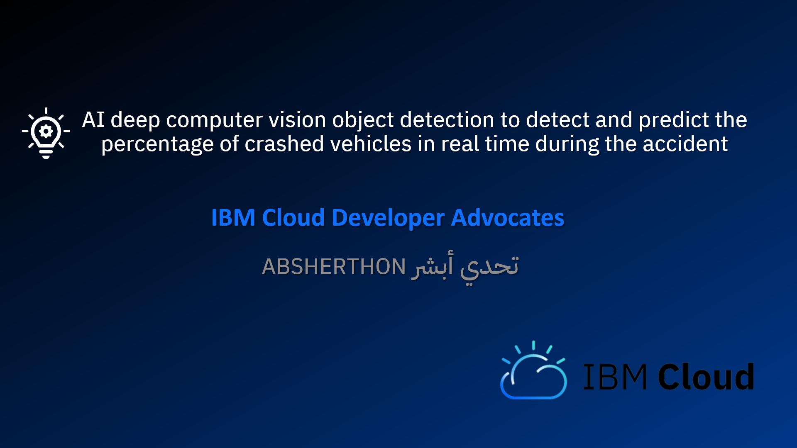
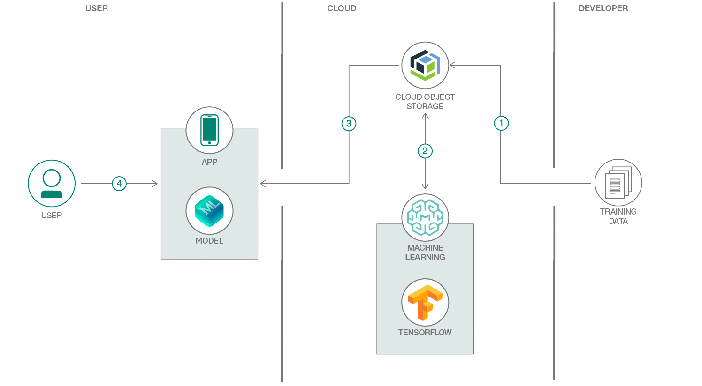
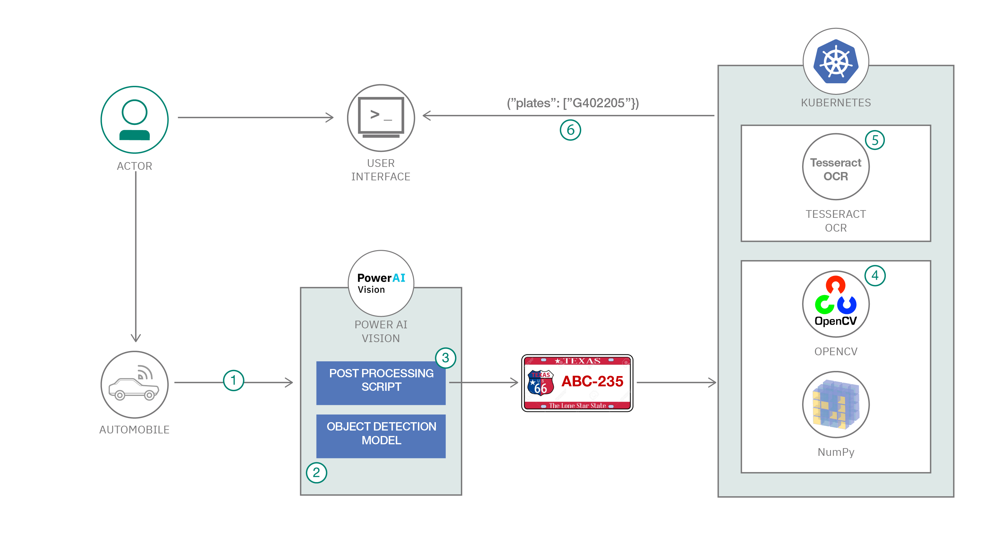

# The Saudi Ministry of Interior Absherthon Challenge 2020 

# Patent:

AI deep computer vision object detection to detect and predict the percentage of crashed vehicles in real-time during the accident. 

# Author: 
Mofaq Althiyabi 

# Proposal Video:

# Objective:

The objective of the idea is the collection of percentage which is divided into 100%, 75% 50%, 25%,0% between drivers. Those percentages are used to calculate of how much being responsible for causing the accident. In addition, the percentage are followed by the Saudi govern law. 

# Problem Statement: 

The big picture of the problem that we are facing in reality is the number of traffic accidents have significantly increased globally over the past decades and become a big problem for human society. Facing these possible and unexpected traffic accidents, and understanding what causes traffic accident, can be difficult to Justify in what percentage of accident cause the rates. 

# Solution:

iam developing innovative solution by collecting a big and diverse data for traffic accident and will use the machine vision to help us to achieve the collection of percentages which can be tracking from the vision of cameras and computer vision. 

# Architecture Diagram Selected 1: 

# Architecture Diagram Selected 2: 

# The hackathon is shut down due to the coronavirus crisis
# Still in progress
