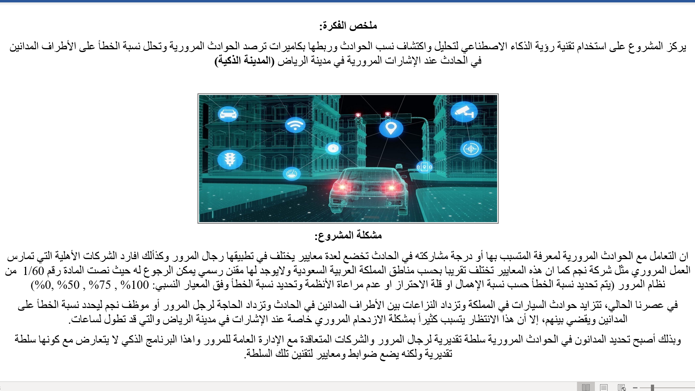
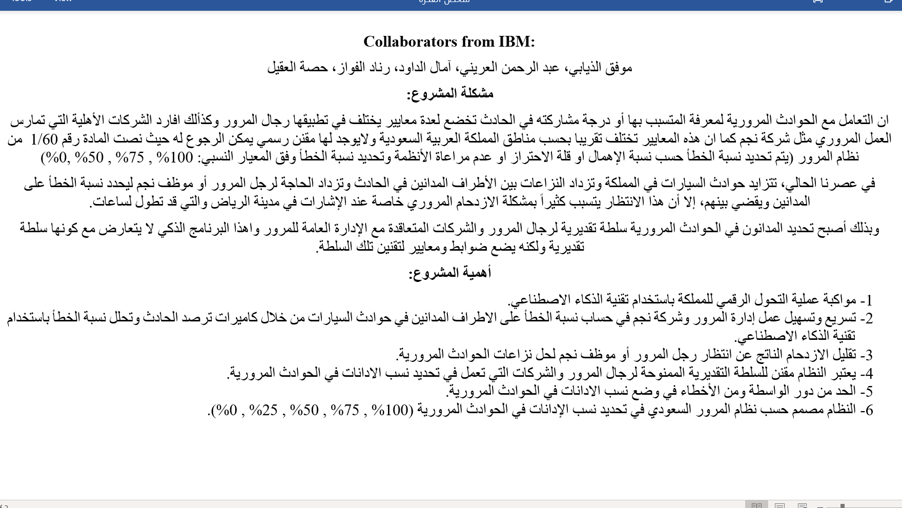
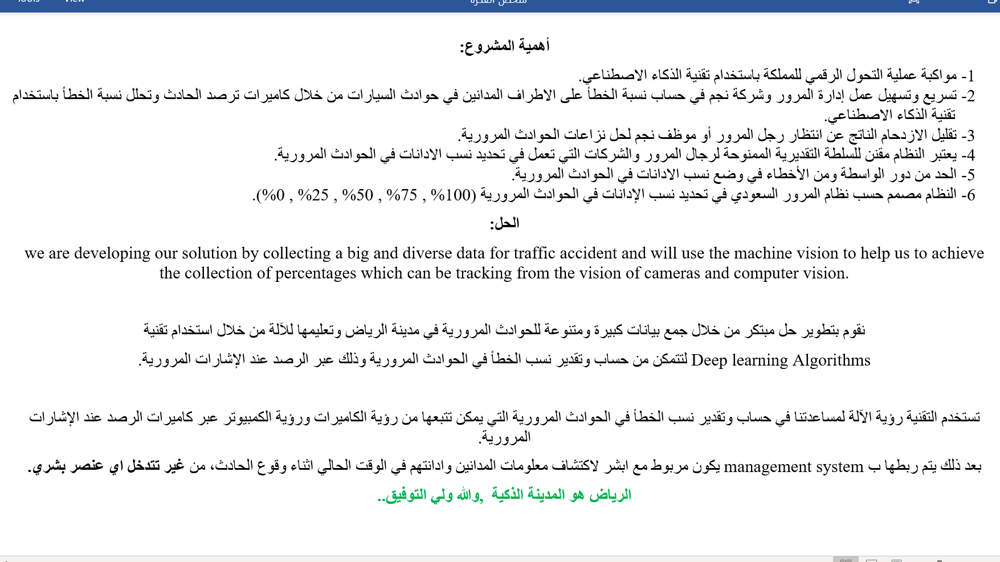
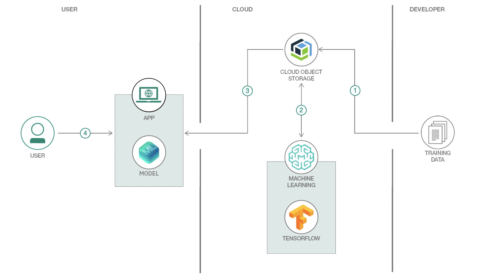

# The Saudi Ministry of Interior Absherthon Challenge 2020 

# Patent:

AI deep computer vision object detection to detect and predict the percentage of crashed vehicles in real-time during the accident. 

# Author of the project: 

موفق الذيابي، مشروع التخرج في الجامعة، بكالوريوس في عام 2014  

# Collaborators from IBM: 

Mofaq Althiyabi, Amal Aldawod, Abdulrahman Aloraini, Renad Alfawaz, Hussah Alakeel

# Proposal Video:

# Objective:

# Problem Statement: 

# Solution:

# Architecture Diagram 1: 

# Architecture Diagram 2: 

