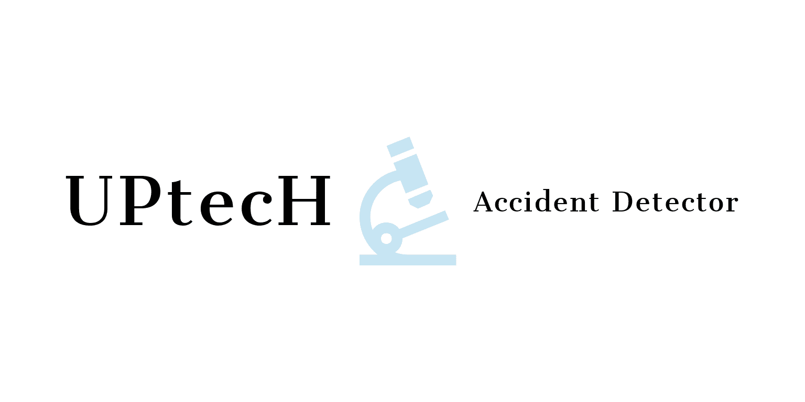

# The Saudi Ministry of Interior Absherthon Challenge 2020 

# Patent:

AI deep computer vision object detection to detect and predict the percentage of crashed vehicles in real-time during the accident. 

# Author of the project: 

موفق الذيابي، مشروع التخرج في الجامعة، بكالوريوس في عام 2014 
 

# contributors from IBM: 

أمل الداوود ، عبدالرحمن العريني ، رناد الفواز ، حصه العقيل

 
 

 Demo:     https://youtu.be/2TnRGZGkQ4o        
 
 أيضا ، هناك مقالة بحثية ، يوجد بها الإحصاءات والمحاكاة المتعلقة بهذا المشروع.

# Proposal Video:

# Objective & Problem Statement: 

# Solution:

# Architecture Diagram 1: 

# Architecture Diagram 2: 

